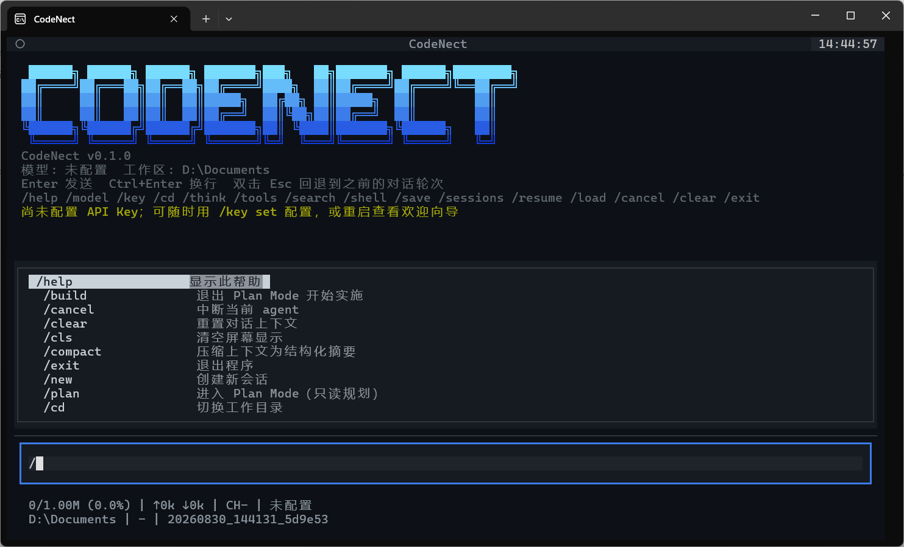
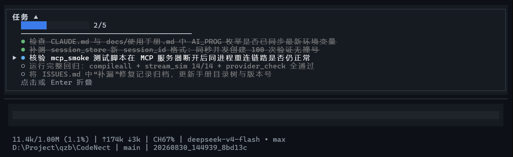

# 基础操作

本页介绍 TUI 的日常交互：输入与发送、命令补全、常用斜杠命令、工作区切换，以及界面上的各种状态指示。

## 输入与发送

| 操作 | 按键 |
| --- | --- |
| 发送 | `Enter` |
| 换行 | `Ctrl + Enter` / `Ctrl + J` |
| 发送以 `/` 开头的文字 | `//` 开头（如 `//help` → 发给 AI） |
| 历史消息 | `↑` `↓`（光标在首/尾行时，非命令输入状态下） |
| 复制选中 | `Ctrl + C`（有选中文本时优先复制，不取消任何东西；输入框内选中同样适用） |
| 复制选中（强制） | `Ctrl + Shift + C`（始终复制当前选中文本；Markdown 消息与代码块按块提取全文，工具结果展开态返回整块原始文本） |

### 命令补全

- 输入 `/` 触发下拉 → `↑` `↓` 导航 → `Tab` / `Enter` 填充（已与高亮项完全一致时 `Enter` 直接发送）→ `Esc` 取消
- `/model ` 等完整命令后自动展开参数选项
- 鼠标：滚轮导航补全 / 左键点击选择（拖选超出视口自动滚动，起点锚定按下位置）

## 常用对话命令

| 命令 | 说明 |
| --- | --- |
| `/help` | 显示完整帮助（分类排版） |
| `/new` | 创建新会话（保存当前，开始新的） |
| `/clear` | 重置当前对话上下文 |
| `/cls` | 清空屏幕显示（不删对话历史） |
| `/compact [补充指示]` | 压缩上下文为结构化摘要（详见[上下文管理](/guide/context)） |
| `/cancel` | 中断当前 Agent 运行 |
| `/exit` | 退出程序 |

## 工作区

| 命令 | 说明 |
| --- | --- |
| `/cd <路径>` | 切换工作目录（自动保存当前会话并开启新会话） |
| `/pwd` | 显示当前工作目录 |

启动时也可以用 `python main.py -C <目录>` 直接指定工作区。

## 运行状态指示

Agent 运行期间，界面各处会显示对应的状态指示：

| 指示 | 位置 | 说明 |
| --- | --- | --- |
| `⠋ CodeNect运行中` | 对话区底部 | 旋转动画 + 蓝色高光扫过，流式输出中 |
| 状态栏第一行蓝色高光扫过 | 状态栏 | Agent 忙碌中（运行 / 执行工具 / 压缩 / 加载） |
| `上下文压缩中 ∙∙∙` | 输入框位置 | 压缩 / 自动压缩期间占用输入框（灰框，不可输入），完成后恢复 |
| `Read auth.py` | 对话区 | 工具调用头（格式化名称；run_shell 前缀实际 shell 名） |
| `✓ 工具名: 结果 点击展开` | 对话区 | 工具执行完成（write / shell / read 默认折叠，patch / search 默认展开） |
| `+ Thought: 标题 · 2.1s` | 对话区 | 思考段（标题从 `**标题**` 格式提取，默认折叠，分段展示在对应工具前） |

## 任务清单

Agent 在复杂任务中会自动通过 `todowrite` 工具维护任务清单，显示在对话区和输入框之间：

- **默认展开**显示完整列表，任务保持原始顺序；点击或 Enter 可折叠回单行摘要（显示「序号/总数 正在进行：任务名」，无进行中任务时显示「下一步」）
- 展开态行首符号表达状态，`▶` 标记当前执行中的行（该行无缩进，其余行右移对齐）：
  - 已完成 `●`（绿色实心圆，文本带删除线）
  - 执行中 `●`（蓝色实心圆，文本白色）
  - 待处理 `○`（灰色空心圆，文本灰色）
  - 已取消 `✗`（灰色）
- 全部完成后面板自动隐藏

## 退出与 Ctrl+C 阶梯

双击 `Ctrl + C`（无选中时）弹出确认框，`Enter` / `Y` / 再按 `Ctrl+C` 确认，`Esc` / `N` 取消。`Ctrl+C` 的完整阶梯行为：

1. 输入框有内容：先清空输入
2. Agent 运行中：取消任务（不退出）
3. 1 秒内双击：弹出退出确认
