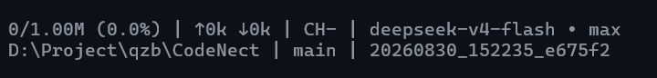

# 上下文管理

长会话会持续消耗上下文窗口。CodeNect 提供三套机制：状态栏实时可见、发送前自动缩减、手动 / 自动压缩。

## 状态栏

状态栏第一行示例：

```text
52.3k/1.00M (5.2%) | ↑1.1M ↓144k | CH99% | deepseek-v4-flash • high
```

| 字段 | 含义 |
| --- | --- |
| `52.3k/1.00M (5.2%)` | 上下文 / 窗口大小（占用率，取自 API usage；无 API 调用时按消息估算并加 `~` 前缀） |
| `↑1.1M ↓144k` | 会话累计输入 ↑ / 输出 ↓ token（最小单位 k，百万以上 M） |
| `CH99%` | 最近一次请求缓存命中率 = 该次命中 / 该次输入（无 API 数据时显示 `CH-`） |
| `deepseek-v4-flash • high` | 模型 • 思考强度（思考关闭时只显示模型名） |

第二行：`工作目录 | 分支 | 会话 id`。



## 发送前自动缩减

每次请求发送前自动缩减（仅影响上行请求，本地存档完整）：

- 最近 12 条消息原样保留
- 更早的工具结果截断到 300 字符
- 同一文件的重复 read_file 只留最新一次（write / patch 之后的重读不去重，内容可能已变）

## 手动压缩（/compact）

`/compact [补充指示]` 用模型生成结构化摘要（目标 / 约束 / 进展 / 关键决定 / 后续步骤 / 关键上下文）：

- 摘要指令直接追加在现有对话末尾发出（就地压缩，请求前缀与平时一致、可命中 DeepSeek 前缀缓存价）
- 压缩后原样保留预算内的全部用户原话 + 近期约 2 万 token 原文
- 再次压缩时并入旧摘要
- 摘要请求自身超窗会自动裁掉最老消息重试
- 压缩前自动备份完整原文到 `<会话ID>_precompact`

## 自动压缩

设置 `AI_PROG_CTX_AUTO_COMPACT` 为阈值 tokens 后，超过阈值自动触发压缩（默认 0 = 关闭，需手动开启）。

## 自查与告警

- 模型可调用 `get_context_remaining` 工具自查剩余上下文预算
- 超过告警阈值（默认 10 万 tokens，`AI_PROG_CTX_WARN` 可调）时提示建议压缩或开新会话
