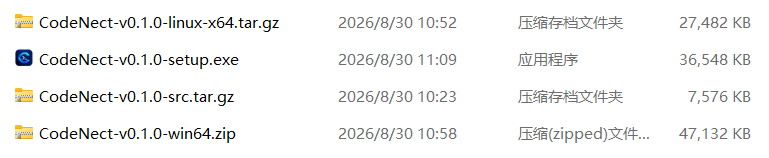
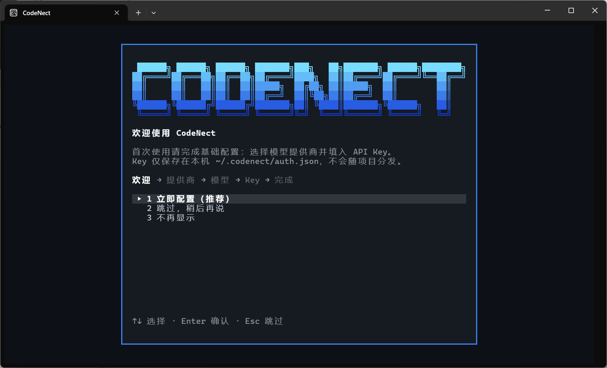

# 快速开始

CodeNect 是一个面向开发者的 AI Coding Agent，在终端中理解项目、编写代码、执行命令并协助完成开发任务。本页带你完成安装、配置 API Key 并开始第一次对话。

## 环境要求

| 平台                | 运行方式           | 要求                                                    |
| ----------------- | -------------- | ----------------------------------------------------- |
| Windows 10/11 x64 | 安装包 / 绿色版（exe） | 无需 Python                                             |
| Linux x86_64      | 二进制绿色版（tar.gz） | 无需 Python；glibc ≥ 2.38（Ubuntu 24.04 及更新发行版）           |
| Linux / macOS     | 源码运行           | Python 3.10+；快照回滚需 git；Linux 剪贴板兜底建议装 xclip / wl-copy |

可选依赖缺失时功能自动降级，不影响主体使用：

| 依赖           | 缺失时的影响                        |
| ------------ | ----------------------------- |
| git          | 文件快照 / 会话回溯中的文件回滚不可用，其余正常     |
| Python       | Agent 无法运行它生成的 pytest 测试，其余正常 |
| node / npx 等 | 仅配置 MCP stdio 服务器时需要          |

## 安装与启动

### Windows

- **安装包**：运行 `CodeNect-v<版本>-setup.exe`，默认装到用户目录（无需管理员），可注册 `codenect` 命令（加入用户 PATH，新开终端生效）
- **绿色版**：解压 `CodeNect-v<版本>-win64.zip`，双击 `CodeNect.exe` 即可，无需安装
- **源码**：双击根目录 `start.bat`（自动创建虚拟环境、安装依赖并进入 TUI），或手动：

```powershell
python -m venv venv
.\venv\Scripts\Activate.ps1
pip install -r requirements.txt
python main.py
```

### Linux / macOS

二进制绿色版（Linux x86_64）：

```bash
tar xzf CodeNect-v<版本>-linux-x64.tar.gz
./CodeNect/CodeNect
```

源码运行：

```bash
./start.sh    # 一键启动（自动建 venv、装依赖；venv 损坏自动重建）
```

或手动：

```bash
python3 -m venv venv
source venv/bin/activate
pip install -r requirements.txt
python main.py
```



## 首次启动&配置 API Key

首次启动时若未配置任何 API Key（且未选择 ollama 等本地厂商），会自动弹出欢迎配置向导：选择提供商 → 模型 → 输入 Key，全程键盘操作（↑↓ / Enter / Esc）。向导可跳过（下次启动再提醒）或选「不再显示」；`/key reset` 清除 Key 后不会重弹。



也可以随时在 TUI 内手动配置：

| 命令           | 说明                                     |
| ------------ | -------------------------------------- |
| `/key`       | 查看已配置的 Key（脱敏显示）                       |
| `/key set`   | 交互设置 Key（支持 12 家厂商 + 自定义站 + Tavily 搜索） |
| `/key reset` | 清除所有 Key（删除 auth.json）                 |

更多提供商与模型配置见[提供商与模型](/guide/providers)。

## 第一次对话

1. 启动后直接在终端里打字与 Agent 对话
2. 输入 `/` 查看全部斜杠命令，`/help` 显示完整帮助
3. `Ctrl+Enter` / `Ctrl+J` 换行；想发送以 `/` 开头的文字给 AI，用 `//` 开头（如 `//help`）

详细操作见[基础操作](/guide/basic-usage)，命令全集见[命令速查](/reference/commands)。

## 升级

直接运行新版安装包覆盖即可，用户数据不受影响（配置与历史会话保存在 `~/.codenect/`，与安装目录隔离）。

## 已知事项

- 首次运行 SmartScreen / 杀毒软件可能拦截（PyInstaller 打包的常见误报），选择「仍要运行」或加白名单即可
- 卸载程序只移除安装目录，`~/.codenect/` 下的配置、会话、日志默认保留；卸载开始时提供「同时删除用户数据」复选框（勾选后不可恢复）
- 配置模板（settings.json / mcp_servers.json 等）在首次启动时自动创建于 `~/.codenect/`，删除后下次启动重建
