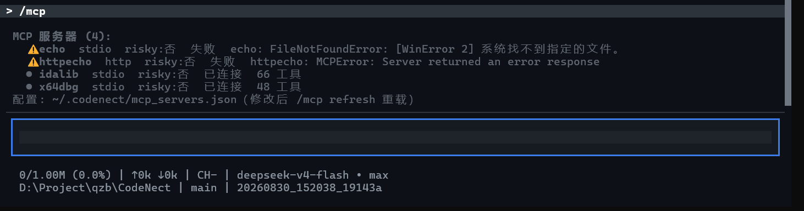

# MCP 扩展

CodeNect 可接入外部 MCP 服务器，其工具以 `<服务器名>_<工具名>` 扁平命名注册进工具系统（非字母数字字符替换为 `_`，超长截断加哈希后缀），Agent 直接调用。配置写在 `~/.codenect/mcp_servers.json`（JSONC，支持注释与尾逗号）：

```jsonc
{
  "db": {                            // 服务器名 = 工具名前缀
    "type": "stdio",                 // 本地子进程服务器
    "command": "python",
    "args": ["scripts/dev/mcp_test_server.py"],
    "cwd": "D:/Project/xxx",         // 可选：工作目录（相对路径以工作区为基准）
    "env": { "K": "V" },             // 可选：附加环境变量
    "timeout": 120,                  // 可选：单次工具调用超时秒数，默认 120
    "risky": false,                  // 可选：true 则该服务器工具执行前需审批
    "max_tools": 200,                // 可选：最多注册工具数（0=不限）
    "enabled": true                  // 可选：false 保留配置但不连接
  },
  "remote": {
    "type": "http",                  // 远程流式 HTTP 服务器
    "url": "https://example.com/mcp",
    "headers": { "Authorization": "Bearer xxx" },   // 可选
    "connect_timeout": 15            // 可选：连接超时秒数（0=用全局默认 30）
  }
}
```

修改配置文件后 TUI 内 `/mcp refresh` 重载生效，无需重启。

## 管理命令

| 命令 | 说明 |
| --- | --- |
| `/mcp` / `/mcp list` | 查看全部服务器状态（名称 / 类型 / 工具数 / 是否审批 / 连接状态与失败原因） |
| `/mcp connect [name]` | 连接服务器（无参 = 全部）；后台执行，完成后回显结果 |
| `/mcp disconnect [name]` | 断开服务器（无参 = 全部，工具同步注销） |
| `/mcp refresh` | 全部断开重连（修改配置文件后重载） |



## 行为说明

- 启动时后台预连全部启用且已配置的服务器；连接失败不影响对话（`/mcp` 查看原因，`/mcp connect` 手动重试）
- 工具默认免审批直接执行；服务器设 `risky: true` 后其全部工具执行前需审批（同内置高危工具：输入框位置显示黄色边框选项，↑↓ 选择 + Enter 确认，1/2 快捷）
- Plan Mode 下 MCP 工具对模型不可见（外部能力无法判定只读性，规划阶段一律禁用）
- 子代理（task）自动继承 MCP 工具
- 调用超时 / 服务器崩溃后返回「工具错误」文本并标记失败，下次调用自动重连
- 与内置工具或与其他服务器撞名的工具跳过注册并在 `/mcp list` 注明
