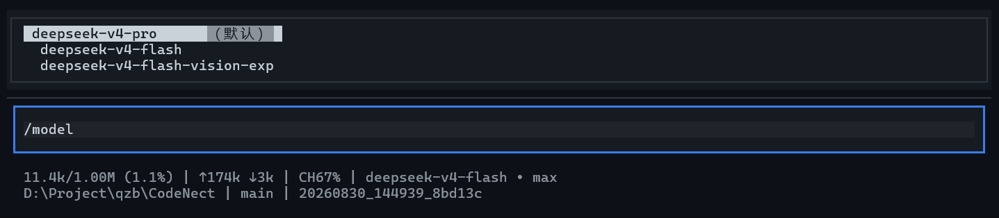

# 提供商与模型

CodeNect 通过厂商档案机制支持 12 家内置提供商与任意 OpenAI 兼容站，全部共用 OpenAI 兼容接口。用户配置（Key / 提供商 / 行为调优）自动持久化到用户目录 `~/.codenect/`（auth.json + settings.json），重启后保持；项目仓库内不保存任何用户配置。

## 切换提供商

| 命令 | 说明 |
| --- | --- |
| `/provider` | 查看当前提供商和模型 |
| `/provider <厂商名>` | 切换提供商：deepseek / claude / openai / moonshot（Kimi）/ zhipu（GLM 国际站）/ zhipu-cn（GLM 国内站）/ dashscope（Qwen）/ minimax / ark（豆包）/ mimo（小米 MiMo）/ openrouter / ollama（本地） |
| `/provider custom <base_url> [模型]` | 接入任意 OpenAI 兼容站（如 `http://localhost:11434/v1`） |

## 切换模型与生成参数

| 命令 | 说明 |
| --- | --- |
| `/model` | 查看当前模型与该厂商提供的模型列表 |
| `/model <模型名>` | 切换模型（任意模型名均可，如 deepseek-v4-flash-vision-exp） |
| `/effort <v>` | 推理强度：low / medium / high / xhigh / max |
| `/temp <v>` | 温度 0.0 - 2.0 |
| `/tokens <v>` | 最大输出 Token（256 - 384000） |
| `/stream on\|off` | 流式输出开关 |
| `/think` | 查看思考模式状态 |
| `/think on` / `/think off` | 开启 / 关闭思考模式（显示灰色推理过程） |
| `/submodel <模型名>\|off` | 子代理专用模型（off = 继承主模型） |

## 搜索提供商

`web_search` 工具使用的搜索后端：

| 命令 | 说明 |
| --- | --- |
| `/search` | 查看当前搜索提供商 |
| `/search auto` | 免费匿名：Parallel 优先，失败降级 Exa（默认） |
| `/search parallel` | 仅 Parallel（免费匿名，无需 Key） |
| `/search exa` | 仅 Exa（免费匿名 50 次/天） |
| `/search tavily` | 使用 Tavily（AI 优化，需 Key，`/key set` 选 13 配置） |

## Shell 解释器

`run_shell` 工具使用的解释器可切换，切换后工具执行立即生效；新会话的 Agent 提示词会按新 shell 注入：

| 命令 | 说明 |
| --- | --- |
| `/shell` | 查看当前解释器 |
| `/shell auto` | 平台默认（Windows = pwsh → powershell → cmd，其他 = sh） |
| `/shell cmd` | Windows cmd（仅 Windows 菜单提供；环境变量配的 cmd 在其他平台自动归一为 sh） |
| `/shell powershell` | Windows PowerShell 5.1 |
| `/shell pwsh` | PowerShell 7+ |
| `/shell bash` / `/shell sh` / `/shell zsh` | Unix shell（需在 PATH 中） |

## 支持的模型

| 提供商 | 环境变量 | 说明 |
| --- | --- | --- |
| DeepSeek | `DEEPSEEK_API_KEY` | 默认，国内直连，便宜 |
| Claude | `ANTHROPIC_API_KEY` | 官方 OpenAI 兼容层；思考内容不回传（/think 无效）；claude-sonnet-5 不接受 temperature（自动不注入） |
| OpenAI | `OPENAI_API_KEY` | 默认模型 gpt-5.6；注意官方限制：Chat Completions 下工具调用仅支持 reasoning_effort=none（推理能力受限，官方推荐 Responses API） |
| Kimi（Moonshot） | `MOONSHOT_API_KEY` | 默认模型 kimi-k3（思考始终开启，强度经 `/model effort` 调节；温度固定 1.0） |
| 智谱 GLM | `ZHIPU_API_KEY` | 国际站 Z.AI（api.z.ai），默认模型 glm-5.3 |
| 智谱 GLM（国内站） | `ZHIPU_CN_API_KEY` | 国内直连 open.bigmodel.cn，默认模型 glm-5.3（Key 与国际站不通用） |
| 小米 MiMo | `MIMO_API_KEY` | 默认模型 mimo-v2.5-pro（思考默认开启） |
| 通义千问（阿里百炼） | `DASHSCOPE_API_KEY` | 默认模型 qwen3.8-max（思考默认关闭，`/think on` 开启） |
| MiniMax | `MINIMAX_API_KEY` | 默认模型 MiniMax-M3（官方端点 api.minimaxi.com，思考经 reasoning_split 拆分展示） |
| 火山方舟（豆包） | `ARK_API_KEY` | 默认模型 doubao-seed-2-1-pro-260628（思考默认开启） |
| OpenRouter | `OPENROUTER_API_KEY` | 聚合平台，模型名形如 `openai/gpt-4o`，须 `/model` 指定 |
| Ollama | 免 Key | 本地 `http://localhost:11434/v1`，须 `/model` 指定已拉取的模型 |
| 自定义兼容站 | `LLM_API_KEY`（可复用任一厂商 Key） | 任意 OpenAI 兼容接口：`/provider custom <base_url> [模型]` |

以上厂商均为 OpenAI 兼容协议，切换方式统一为 `/provider <厂商名>`（或 `/key set` 选择厂商）；默认模型名以 `core/llm_client.py` 的 `_PROVIDERS` 表为准。

### DeepSeek 模型对比

| | v4-pro | v4-flash | v4-flash-vision-exp |
| --- | --- | --- | --- |
| 定位 | 强推理 | 快 / 省钱 | 视觉实验版（文本能力同 flash） |
| 输入 | 4.5 元/百万 tokens（缓存命中 0.15） | 1.5 元/百万 tokens（缓存命中 0.05） | 同 flash（图片按 token 计，单图最多 384 tokens） |
| 输出 | 13.5 元/百万 tokens | 4.5 元/百万 tokens | 同 flash |
| 上下文 | 1M | 1M | 1M |
| TUI 切换 | `/model deepseek-v4-pro` | `/model deepseek-v4-flash` | `/model deepseek-v4-flash-vision-exp` |

- 以上为空闲时段价格，高峰时段（工作日 9:00-12:00、14:00-18:00）翻倍
- 本项目 Agent 消息链为纯文本（无图片输入工具），vision-exp 按文本模型使用
