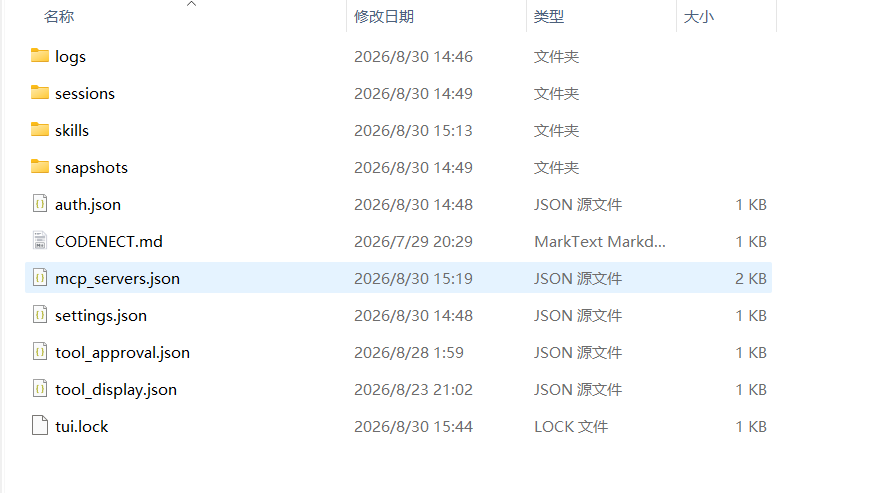

# 配置文件

用户数据全部保存在用户目录 `~/.codenect/`（跨项目共享，不入仓库）。首次启动时自动创建以下配置模板（仅当文件不存在时创建，绝不覆盖已有配置；删除模板文件后下次启动重建，视为重置为模板）：`settings.json`（全键当前默认值）、`tool_display.json` / `tool_approval.json` / `mcp_servers.json`（注释头字段说明 + 空配置）、`skills/`（技能包目录与说明）。空配置即走代码内置默认行为。

```text
~/.codenect/
├── auth.json           # Key 与提供商配置
├── settings.json       # 行为配置（思考 / 温度 / 搜索等）
├── tool_display.json   # 工具结果折叠 / 预览配置
├── tool_approval.json  # 工具审批配置
├── mcp_servers.json    # MCP 服务器配置
├── welcome_done        # 首启欢迎向导标记
├── CODENECT.md         # 全局指令文件
├── skills/             # 全局技能包
├── sessions/           # 会话存档（按工作区分文件夹）
├── snapshots/          # 文件快照（影子 git 仓库，会话回溯用）
└── logs/
    ├── debug.log       # 调试日志
    └── token_usage.csv # Token 流水与费用
```



## auth.json — Key 与提供商配置

```json
{
  "DEEPSEEK_API_KEY": "sk-xxxxxxxx",
  "LLM_PROVIDER": "deepseek",
  "LLM_MODEL": "deepseek-v4-pro",
  "TAVILY_API_KEY": "tvly-xxxxxxxx"
}
```

存放在用户目录（与项目仓库隔离，防止 Key 随代码分发泄露）。TUI 中的 `/key set`、`/provider`、`/model` 等命令自动更新。加载优先级：系统环境变量 > auth.json > settings.json。

## settings.json — 行为配置持久化

```json
{
  "AI_PROG_THINKING": "1",
  "AI_PROG_REASONING_EFFORT": "high",
  "AI_PROG_TEMPERATURE": "0.3",
  "AI_PROG_MAX_TOKENS": "32000",
  "AI_PROG_STREAM": "1",
  "AI_PROG_SEARCH_PROVIDER": "auto"
}
```

TUI 中的 `/think on`、`/model temp`、`/search tavily`、`/noapproval on` 等命令自动更新。旧版存放于项目 `.env` 的行为配置首次运行会自动迁移到此文件，迁移后 `.env` 不再被读取。首次启动自动创建为全键默认值模板（含 `AI_PROG_SHELL` / `AI_PROG_NO_APPROVAL` 等全部 12 键），删除后下次启动重建。

## tool_display.json — 工具结果展示配置

```jsonc
// 工具结果折叠 / 预览配置（AI_PROG_TOOL_DISPLAY）
{
  "collapsed": {                       // 逐工具默认折叠（true=折叠 false=展开）
    "write_file": true,
    "run_shell": true,
    "read_file": true,
    "list_files": true,
    "todowrite": true,
    "ask_user": true
  },
  "preview_lines": {                   // 折叠态预览行数（0=不显示预览）
    "write_file": 10,
    "run_shell": 0
  },
  "cmd_preview_chars": {               // run_shell 命令预览字符数
    "run_shell": 60
  }
}
```

- 支持 `//`、`#` 行注释、`/* */` 块注释与尾逗号（JSONC），方便阅读与编辑
- 优先级：逐工具 `collapsed` > 全局 `default` > 内置默认；坏 JSON 或非法数值静默回退对应默认，不会崩溃；`preview_lines` / `cmd_preview_chars` 上限 10000
- 启动时解析后注入环境变量 `AI_PROG_TOOL_DISPLAY`；系统环境变量优先于该文件
- 早期版本存于 settings.json 的该配置首次运行会自动迁移到此文件并删除原键
- TUI 命令不会覆盖此文件

各工具的默认展示行为见[内置工具与审批](/guide/tools)。

## tool_approval.json — 工具审批配置

```jsonc
// 工具审批配置（AI_PROG_TOOL_APPROVAL）
{
  "read_file": true,    // 强制：read_file 执行前需审批
  "run_shell": false,   // 豁免：run_shell 免审批
  "*": false            // 兜底：未列出的工具走内置默认（true=全部需要审批）
}
```

- 任意内置工具或 MCP 工具（扁平名 `<服务器名>_<工具名>`）都可以配置为需要审批（true）或免审批（false）；未列出的工具走内置默认（`write_file` / `patch_file` / `run_shell` / `task` 需要审批，其余免审批），键 `*` 是未列出工具的兜底默认值
- 子代理内的工具调用同样受本配置约束
- 支持 JSONC 注释与尾逗号；启动时解析后注入环境变量 `AI_PROG_TOOL_APPROVAL`，系统环境变量优先于该文件
- 修改文件后需重启生效；该文件手工编辑，TUI 命令不覆盖
- 注意 `ask_user` / `plan_enter` 本身就走提问流程（弹窗），不要配 true（会先走内联审批再提问）

## mcp_servers.json — MCP 服务器配置

MCP 服务器列表，格式与行为说明见 [MCP 扩展](/guide/mcp)。支持 JSONC 注释与尾逗号；启动时解析后注入环境变量 `AI_PROG_MCP_SERVERS`，系统环境变量优先于该文件。修改后 TUI 内 `/mcp refresh` 重载生效，无需重启。该文件手工编辑，TUI 命令不覆盖。

## welcome_done — 首启欢迎向导标记

欢迎向导完成配置或选「不再显示」时写入（「跳过」不写，下次启动再提醒）。该文件不是配置模板，删除后不会由 `ensure_templates` 自动重建，而是下次启动重新判定（未配置任何 Key 时再次弹出向导）；`/key reset` 不删除此标记——清除 Key 后重启不会再弹欢迎屏。

## logs/ — 运行期日志与统计

- `debug.log` — 调试日志：Agent 循环事件、LLM 请求 / 响应与错误、MCP 连接事件、**主线程 / 工作线程未捕获异常（含完整 traceback）**、启动环境快照（OS / Python / Textual 版本 / provider / model，定位环境问题第一手信息）。2MB 超限自动保留最近 500KB；级别可用 `AI_PROG_LOG_LEVEL` 调整（DEBUG / INFO / WARNING / ERROR，默认 DEBUG，低于阈值不落盘）
- `token_usage.csv` — Token 流水与费用（每次 API 调用一行，`/report` 据此统计）

反馈问题的收集清单见[数据与日志](/advanced/data-and-logs)。

## 会话存档

每个会话包含：id、标题、时间、工作区、模型、完整消息列表（含思考内容和工具调用元数据）。按工作目录分文件夹存放，有用户消息时自动保存。详见[会话管理](/guide/sessions)。

## 工作区 tool-output/ — 超限工具输出存档

工具输出超过行数 / 字节上限时，完整输出写入工作区根目录下的 `tool-output/`（递增编号 txt 文件，7 天自动清理），截断提示附文件路径，模型可用 read_file 分段读或 search 检索。该目录是 CodeNect 的运行期产物，建议加入 .gitignore（本仓库已忽略）。
